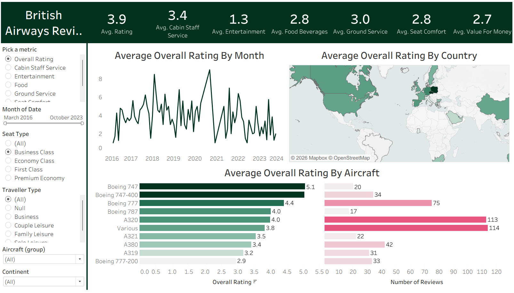

# British Airways Reviews Dashboard (Tableau)

## Project Overview
This project presents an interactive Tableau dashboard designed to analyze customer reviews and evaluate passenger satisfaction across British Airways services.

The objective is to transform raw customer feedback data into actionable insights, helping identify strengths, weaknesses, and opportunities for improving the overall passenger experience.

---

## Objectives
- Analyze overall customer satisfaction levels  
- Evaluate performance across key service categories  
- Identify trends in customer ratings over time  
- Compare aircraft performance based on passenger feedback  
- Explore geographic patterns in customer experience  

---

## Key Insights

- Average customer rating stands at approximately 3.9, indicating moderate satisfaction  
- Cabin staff service performs strongly compared to other categories  
- In-flight services such as food and entertainment show relatively lower ratings  
- Boeing 747 records higher customer satisfaction compared to other aircrafts  
- Monthly trends reveal fluctuations in ratings, indicating varying service consistency  
- Customer experience differs across countries, highlighting regional variations  

---

## Dashboard Features

### Customer Satisfaction Analysis
- Overall rating overview with aggregated KPIs  
- Service-level performance comparison  

### Service Performance Breakdown
- Detailed analysis of:
  - Cabin Staff Service  
  - Food Quality  
  - Entertainment  
  - Ground Service  

### Time-Series Analysis
- Monthly trend of customer ratings  
- Identification of improvement or decline over time  

### Aircraft Comparison
- Performance evaluation by aircraft type  
- Identification of top-performing aircraft  

### Geographic Analysis
- Country-level comparison of customer satisfaction  
- Regional performance insights  

---

## Tools & Technologies

- Tableau – Data visualization and dashboard development  
- Excel / CSV – Data cleaning and preprocessing  

---

## Data Analysis Approach

- Cleaned and structured raw customer review data  
- Aggregated ratings to compute KPIs and averages  
- Performed comparative analysis across services and aircrafts  
- Applied time-series analysis to identify trends  
- Designed interactive visuals for intuitive exploration  

---

## Business Value

This dashboard provides valuable insights for:
- Improving service quality in underperforming areas  
- Enhancing customer satisfaction strategies  
- Supporting data-driven decision-making in airline operations  
- Identifying high-performing services and aircrafts  

---

## Project Structure

British-Airways-Reviews-Dashboard  
├── Tableau Workbook (.twbx)  
├── Dataset  
├── Screenshots  
└── README.md  

---

## How to Use

1. Download the Tableau workbook file  
2. Open using Tableau Desktop or Tableau Public  
3. Use filters and interactive visuals to explore insights  

---

## Dashboard Preview

---

## Skills Demonstrated

- Data Visualization  
- Customer Analytics  
- Time-Series Analysis  
- Data Storytelling  
- Dashboard Design  
- Business Insight Generation  

---

## Conclusion

This project demonstrates the ability to analyze customer feedback data and convert it into actionable business insights. It highlights how data visualization can be leveraged to improve service quality and enhance customer experience.

---

## Connect

LinkedIn: [[Your LinkedIn Link] ](https://www.linkedin.com/in/hidayat-ullah-5060743b6/) 
GitHub: [Your GitHub Profile]  

---

## Support

If you found this project useful, consider giving it a star on GitHub.
